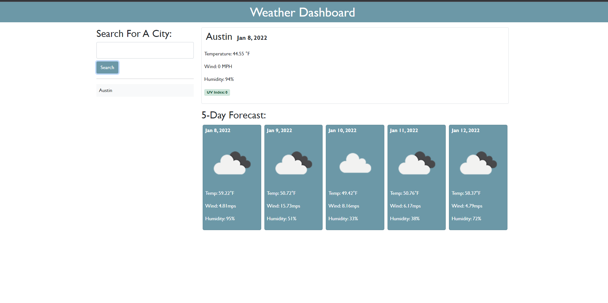

# Weather Dashboard

## Table of contents
* [Weather Dashboard Link](https://chiarans.github.io/weather-dash/)
* [General info](#general-info)
* [Technologies](#technologies)
* [Useful Links](#useful-links)

## General info
This project is a website that allows you to search the current weather in a city of your choice. It will display the temperature, wind speed, humidity, date, and a color-coded uv index. Below the current weather is the predicted forcast for the next 5 days. 
	
## Technologies
Project is created with (all through VScode extension):
* HTML
* CSS
* JavaScript
* Bootstrap
* Jquery
* Moment.js
	
## Useful Links
Weather, forecast, and uv index api website: https://openweathermap.org/
Moment.js for the current and future date style: https://momentjs.com/

